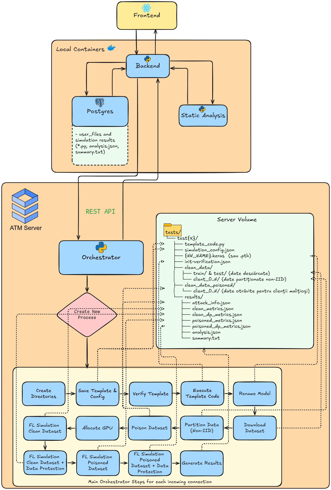

# FL Simulator — Federated Learning Data Poisoning Attack Simulation Platform

A full-stack platform for simulating **data poisoning attacks** within a **Federated Learning (FL)** environment. Users define neural network models (TensorFlow or PyTorch), configure attack scenarios, and run multi-GPU simulations — all through a Jupyter-inspired web interface with real-time progress tracking, result analysis, and export capabilities.

---

## Table of Contents

- [Architecture Overview](#architecture-overview)
- [Infrastructure Requirements](#infrastructure-requirements)
- [Getting Started](#getting-started)
  - [Machine 1 — Application Server (Docker)](#machine-1--application-server-docker)
  - [Machine 2 — GPU Server (Orchestrator)](#machine-2--gpu-server-orchestrator)
- [Orchestrator Pipeline — Step by Step](#orchestrator-pipeline--step-by-step)
- [Platform Features](#platform-features)
  - [Simulation Parameters](#simulation-parameters)
  - [Data Poisoning Attacks](#data-poisoning-attacks)
  - [Robust Aggregation Defenses](#robust-aggregation-defenses)
  - [Evaluation Metrics](#evaluation-metrics)
- [Frontend Features](#frontend-features)
- [API Reference](#api-reference)
- [Project Structure](#project-structure)
- [Tech Stack](#tech-stack)

---

## Architecture Overview

The platform follows a **two-machine distributed architecture**:



---

## Infrastructure Requirements

| Component | Machine 1 — App Server | Machine 2 — GPU Server |
|-----------|----------------------|----------------------|
| **Purpose** | Hosts the web UI, API, and database | Runs the actual FL simulations |
| **Docker** | ✅ Required | ❌ Not required |
| **GPU** | ❌ Not required | ✅ Required (NVIDIA, CUDA) |
| **Storage** | ~10 GB (Docker images + DB) | ~50+ GB (datasets, models, conda envs) |
| **RAM** | 4 GB minimum | 16+ GB recommended |
| **Software** | Docker, Docker Compose | Python 3.10+, Anaconda, nvidia-smi |
| **Network** | Must be reachable by users | Must be reachable by Machine 1 |

---

## Getting Started

### Machine 1 — Application Server (Docker)

#### 1. Clone the repository

```bash
git clone https://github.com/Tudorx95/BachelorThesisProject.git
cd BachelorThesisProject
```

#### 2. Configure secrets

Create the `secrets/` directory and populate the secret files:

```bash
mkdir -p secrets
echo "your-db-password" > secrets/db_password.txt
echo "your-jwt-secret-key" > secrets/secret_key.txt
echo "your-orchestrator-password" > secrets/orchestrator_password.txt
```

> **⚠️ Important:** Never commit the `secrets/` directory to version control. It is already excluded via `.gitignore`.

#### 3. Update orchestrator URL

In `docker-compose.yaml`, update the `ORCHESTRATOR_URL` environment variable in the `backend` service to point to your GPU server:

```yaml
- ORCHESTRATOR_URL=http://<GPU_SERVER_IP>:8000
```

#### 4. Start the platform

```bash
docker compose up --build -d
```

This starts three containers:

| Container | Port | Description |
|-----------|------|-------------|
| `fl_postgres` | 5432 | PostgreSQL 16 database |
| `fl_backend` | 8000 | FastAPI REST API + WebSocket |
| `fl_frontend` | 3000 | React web application |

Access the platform at **http://localhost:3000**.

#### 5. Demo credentials

A demo user is created automatically:
- **Username:** `demo`
- **Password:** `demo123`

---

### Machine 2 — GPU Server (Orchestrator)

#### 1. Copy the orchestrator files

Transfer the `orchestrator_backend_server/` directory to the GPU server:

```bash
scp -r orchestrator_backend_server/ user@gpu-server:/path/to/orchestrator/
```

#### 2. Install dependencies

```bash
cd /path/to/orchestrator
pip install -r requirements.txt
```

#### 3. Set up Conda environments

Create separate Conda environments for each supported framework:

```bash
# TensorFlow environment
conda create -n fl_tensorflow python=3.10 -y
conda activate fl_tensorflow
pip install tensorflow numpy Pillow scikit-learn

# PyTorch environment
conda create -n fl_pytorch python=3.10 -y
conda activate fl_pytorch
pip install torch torchvision numpy Pillow scikit-learn
```

#### 4. Configure credentials

In `orchestrator_gpu.py`, update the `VALID_USERS` dictionary and file paths:

```python
VALID_USERS = {"tudor": "your-orchestrator-password"}
BASE_DIR = Path("/path/to/fl_simulations")
CONDA_BASE = Path("/path/to/anaconda3")
```

#### 5. Start the orchestrator

```bash
nohup python -u orchestrator_gpu.py > output.log 2>&1 &
```

Verify it is running:

```bash
curl http://localhost:8000/
# Expected: {"message": "FL Orchestrator API", "status": "running", "available_gpus": [...]}
```

Monitor logs in real time:

```bash
tail -f output.log
```

---

## Orchestrator Pipeline — Step by Step

When a user clicks **Run** on the frontend, the following pipeline executes on the GPU server inside `run_simulation_pipeline()`:

### Step 0 — GPU Allocation

The `GPUManager` detects all available NVIDIA GPUs via `nvidia-smi` and maintains a thread-safe queue. Each simulation requests a dedicated GPU (with a 10‑minute timeout). If no GPU is available, it falls back to CPU. The GPU is **always released** in the `finally` block, even on errors or cancellations.

### Step 1 — Directory Setup

Creates an isolated workspace for the task:

```
fl_simulations/
 └── user_{id}/
      └── {task_uuid}/
           ├── clean_data/            # Original dataset
           ├── clean_data_poisoned/   # Poisoned dataset copy
           └── results/               # Output metrics & analysis
```

### Step 2 — Save Template & Config

- Writes the user's model code to `template_code.py`
- Saves the simulation configuration (N, M, R, ROUNDS, attack params) as `simulation_config.json`

### Step 3 — Framework Detection

Automatically detects whether the template uses **TensorFlow** or **PyTorch** by inspecting `import` statements, then activates the appropriate Conda environment (`fl_tensorflow` or `fl_pytorch`).

### Step 4 — Template Verification

Runs `verify_template.py` which performs **static analysis** on the user's code to ensure it defines the required interface (e.g., `download_data()`, model creation, proper training structure) before any GPU resources are consumed.

### Step 5 — Model Training

Executes the user's `template_code.py` on the allocated GPU with `CUDA_VISIBLE_DEVICES` set. This step:
- Creates the neural network model defined by the user
- Trains it on the specified dataset
- Saves the model file (`.keras` for TensorFlow, `.pth` for PyTorch)
- Records initial accuracy in `init-verification.json`

### Step 6 — Dataset Download

Calls the `download_data()` function defined in the user's template to fetch and prepare the training/test data into the `clean_data/` directory.

### Step 7 — Data Poisoning

Runs `poison_data.py` against the clean dataset, applying the user-configured attack to generate the `clean_data_poisoned/` directory. Supports 7 attack types with per-attack parameters (see [Data Poisoning Attacks](#data-poisoning-attacks)).

### Step 8 — Federated Learning Simulations (3 Scenarios)

The `fd_simulator.py` script runs three FL simulations sequentially, each using the same model but different data/aggregation:

| Scenario | Data | Aggregation | Purpose |
|----------|------|-------------|---------|
| **Clean** | `clean_data/` | FedAvg | Baseline — no attack |
| **Poisoned** | `clean_data_poisoned/` | FedAvg | Measure attack impact |
| **Poisoned + Protection** | `clean_data_poisoned/` | User-selected method | Evaluate defense |

Each scenario distributes data across `N` clients, where `M` are malicious and use the poisoned data for `R` rounds out of `ROUNDS` total.

### Step 9 — Result Aggregation

Loads the metrics from all three scenarios, computes:
- **Init / Clean / Poisoned / Poisoned+DP Accuracy**
- **Accuracy drops** between scenarios
- **Precision, Recall, F1 Score** (weighted average) per scenario

Saves to:
- `results/analysis.json` — structured JSON with all metrics
- `results/summary.txt` — human-readable summary
- `results/attack_info.json` — poisoning attack details

The orchestrator marks the task as `completed`, and the backend polls these results back to the frontend via WebSocket.

### Cancellation Flow

At every pipeline step, the orchestrator checks if the user has requested cancellation. If so:
1. The running process tree is killed (`kill_process_tree()`)
2. The allocated GPU is released
3. The task directory is deleted
4. Status is set to `cancelled`

---

## Platform Features

### Simulation Parameters

| Parameter | Description |
|-----------|-------------|
| `N` | Total number of FL clients |
| `M` | Number of malicious clients |
| `ROUNDS` | Total training rounds |
| `R` | Number of rounds malicious clients use poisoned data |
| `NN_NAME` | Neural network model name |
| `strategy` | Malicious client distribution: `first`, `last`, or `alternate` |

### Data Poisoning Attacks

| Attack Type | Description |
|-------------|-------------|
| **Label Flip** | Flips the class label of a percentage of samples to a target class (user-selected or random) |
| **Backdoor — BadNets** | Injects a small trigger pattern (cross, square, etc.) onto a percentage of images |
| **Backdoor — Blended** | Blends the original image with a key pattern using a configurable ratio ([paper](https://arxiv.org/pdf/1712.05526)) |
| **Backdoor — Sinusoidal** | Adds a sinusoidal signal to images with user-configurable frequency and amplitude |
| **Backdoor — Trojan** | Inserts a watermark-style trigger into images (conceptually similar to BadNets) |
| **Backdoor — Semantic** | Modifies natural image features (brightness, RGB tint) |
| **Edge-Case Backdoor** | Applies image transformations: rotation, color reduction, solarization, or grayscale intensity reduction |

### Robust Aggregation Defenses

| Method | Description |
|--------|-------------|
| **FedAvg** | Weighted average of client weights, proportional to dataset size. Standard method, but vulnerable to poisoning |
| **Krum** | Selects the single client update with lowest total distance to all others, isolating malicious clients |
| **Trimmed Mean** | Removes the top and bottom 20% extreme weight values, then averages the remainder |
| **Median** | Replaces the mean with a per-parameter median, resistant to up to ~20% malicious clients |
| **Trimmed Mean + Krum** | Hybrid approach combining Trimmed Mean filtering (trim_ratio=0.1) with Krum selection |
| **Random** | Randomly selects one client's weights. Used as a comparison baseline |

### Evaluation Metrics

Collected **per round** and **per scenario** (Clean / Poisoned / Poisoned+DP):

- **Accuracy** — global classification accuracy
- **Precision** — weighted average
- **Recall** — weighted average
- **F1 Score** — weighted average

---

## Frontend Features

- **Jupyter-style notebook interface** with code cells and output cells
- **Monaco Code Editor** with syntax highlighting and predefined templates (TensorFlow / PyTorch toggle)
- **Sidebar** with project and file management, including drag-and-drop reordering
- **Real-time simulation progress** with step-by-step status indicators (ProgressStep component)
- **Simulation results display** — summary text + detailed JSON analysis
- **Advanced simulation configuration** — modal with full control over clients, rounds, attack type, attack parameters, and defense method
- **Compare Page** — side-by-side comparison of two simulations, including FL config, attack parameters, and all metrics
- **Graphs Page** — interactive bar charts (Recharts) for visualizing multiple simulations with grouped metrics
- **PDF export** — individual simulation results as PDF (includes config, metrics, confusion matrix data, and summary)
- **CSV export** — multi-select file export with all metrics per scenario in a tabular format
- **Dark / Light mode** with persistent user preference

---

## API Reference

### Authentication

| Method | Endpoint | Description |
|--------|----------|-------------|
| POST | `/api/auth/register` | Register a new user |
| POST | `/api/auth/login` | Login and receive JWT token |
| GET | `/api/auth/me` | Get current user info |

### Projects

| Method | Endpoint | Description |
|--------|----------|-------------|
| GET | `/api/projects` | List user's projects |
| POST | `/api/projects` | Create a new project |
| GET | `/api/projects/:id` | Get project details |
| DELETE | `/api/projects/:id` | Delete a project |

### Files

| Method | Endpoint | Description |
|--------|----------|-------------|
| GET | `/api/projects/:id/files` | List files in a project |
| POST | `/api/projects/:id/files` | Create a new file |
| GET | `/api/files/:id` | Get file content |
| PUT | `/api/files/:id` | Update file content |
| DELETE | `/api/files/:id` | Delete a file |
| PATCH | `/api/files/:id/rename` | Rename a file |
| PATCH | `/api/files/:id/move` | Move file to another project |
| POST | `/api/files/reorder` | Bulk reorder files |

### Simulations

| Method | Endpoint | Description |
|--------|----------|-------------|
| POST | `/run` | Submit a simulation |
| POST | `/cancel/:task_id` | Cancel a running simulation |
| GET | `/api/simulations` | List simulation history |
| GET | `/api/simulations/:task_id` | Get simulation result |

### Orchestrator (GPU Server)

| Method | Endpoint | Description |
|--------|----------|-------------|
| GET | `/` | Health check + GPU status |
| POST | `/login` | Authenticate |
| POST | `/simulate` | Start a simulation pipeline |
| GET | `/status/:task_id` | Poll task status |
| GET | `/results/:task_id` | Fetch completed results |
| POST | `/cancel/:task_id` | Cancel and cleanup |
| GET | `/gpu_status` | Current GPU allocation info |

---

## Project Structure

```
BachelorThesisProject/
│
├── docker-compose.yaml              # Multi-container setup (DB + Backend + Frontend)
├── secrets/                          # Docker secrets (gitignored)
│   ├── db_password.txt
│   ├── secret_key.txt
│   └── orchestrator_password.txt
│
├── backend/                          # FastAPI REST API
│   ├── Dockerfile
│   ├── main.py                       # All endpoints, models, auth, WebSocket
│   └── requirements.txt
│
├── simulator_frontend/               # React SPA
│   ├── Dockerfile
│   ├── package.json
│   └── src/
│       ├── App.jsx                   # Main app with routing
│       ├── components/
│       │   ├── CodeCell.jsx          # Monaco code editor cell
│       │   ├── OutputCell.jsx        # Simulation output display
│       │   ├── Sidebar.jsx           # Project/file tree + drag-and-drop
│       │   ├── SimulationOptions.jsx # Attack & defense config modal
│       │   ├── ProgressStep.jsx      # Real-time step indicators
│       │   ├── ExportPDFButton.jsx   # PDF result export
│       │   ├── MultiExportCSV.jsx    # Multi-simulation CSV export
│       │   └── TopBar.jsx            # Top navigation bar
│       ├── pages/
│       │   ├── Login.jsx
│       │   ├── Register.jsx
│       │   ├── ComparePage.jsx       # Side-by-side simulation comparison
│       │   └── GraphsPage.jsx        # Interactive charts
│       └── context/                  # React Context (auth, simulation state)
│
├── database/
│   └── init.sql                      # Schema + demo data
│
├── orchestrator_backend_server/      # GPU server (runs independently)
│   ├── orchestrator_gpu.py           # Flask API + simulation pipeline
│   ├── gpu_manager.py                # GPU allocation/deallocation
│   ├── fd_simulator.py               # Federated Learning simulator
│   ├── poison_data.py                # Data poisoning engine (v1)
│   ├── poison_data_v2.py             # Extended poisoning (7 attack types)
│   ├── fl_monitor.py                 # FL monitoring utilities
│   ├── train_model.py                # Model training helper
│   ├── template_code.py              # TensorFlow template reference
│   ├── template_code_pytorch.py      # PyTorch template reference
│   └── requirements.txt
│
└── Templates/                        # Code templates shown in the editor
    ├── template_antrenare_tensorflow.py
    ├── template_antrenare_pytorch.py
    └── verify_template.py            # Template structure validator
```

---

## Tech Stack

| Layer | Technology |
|-------|-----------|
| **Frontend** | React 18, Monaco Editor, Recharts, TailwindCSS, Lucide Icons |
| **Backend API** | FastAPI, SQLAlchemy, Pydantic, PyJWT, Passlib (bcrypt) |
| **Database** | PostgreSQL 16 |
| **Orchestrator** | Flask, multiprocessing, psutil, GPUManager |
| **ML Frameworks** | TensorFlow / PyTorch (via Conda environments) |
| **Infrastructure** | Docker, Docker Compose, Docker Secrets |
| **GPU Management** | nvidia-smi, CUDA, per-process GPU isolation |

---

## License

This project is part of a Bachelor's Thesis at the Military Technical Academy "Ferdinand I" Bucharest.
